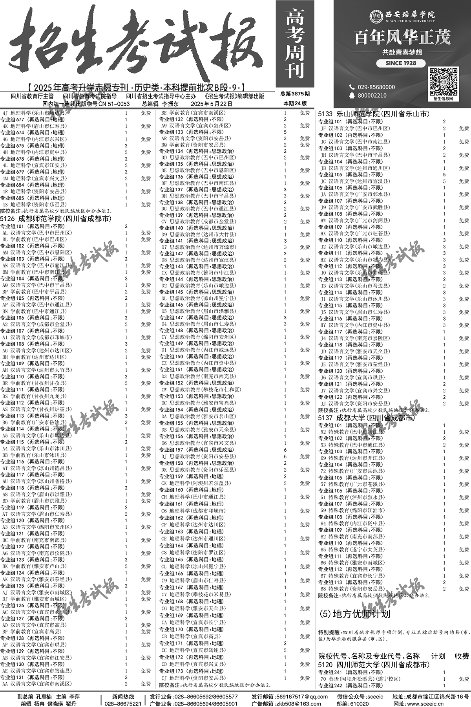
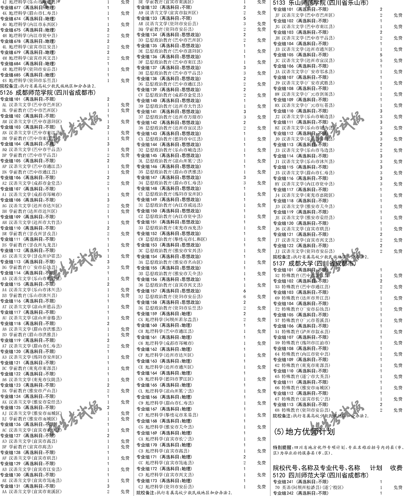

# 四川高考招生信息抓取和整理

教育部在网上公布的各类招生信息特点为：

- 信息是图片方式，无法直接拷贝和粘贴文字信息。
- 图片有水印，增加文字识别难度。

这增加了对所有学校招生信息进行汇总，统计的难度。因此需要对不同网站，不同类型的招生信息，具体分析，然后进行图片抓取和文字识别。

## 四川省高考招生信息

历史类：[https://plan.sceea.cn/wkjh.html](https://plan.sceea.cn/wkjh.html)

物理类：[https://plan.sceea.cn/lkjh.html](https://plan.sceea.cn/lkjh.html)

汇总了所有高校在四川省的招生专业和招生人数。网址不变，但里面的内容每年会更新。

通过在浏览器里打开开发者工具，切换到network，并在网页上点击“上一页”和“下一页”进行翻页，可以看到所有页面信息为gif图片。

历史类第一页为：

[https://plan.sceea.cn/img/wk/wk%20(1).gif](https://plan.sceea.cn/img/wk/wk%20(1).gif)

后面每页网站一次增加括号里的数字。最后一页为：

[https://plan.sceea.cn/img/wk/wk%20(140).gif](https://plan.sceea.cn/img/wk/wk%20(140).gif)

物理类第一页：

[https://plan.sceea.cn/img/lk/lk%20(1).gif](https://plan.sceea.cn/img/lk/lk%20(1).gif)

最后一页：

[https://plan.sceea.cn/img/lk/lk%20(232).gif](https://plan.sceea.cn/img/lk/lk%20(232).gif)

下面是信息提取和结构化的流程。

## Step 1
从网络上下载考试报的所有页面。保存在目录"01.raw.gif"中。历史类和物理类分别保存在子目录"history"和"physics"中。以下各步骤文件保存的方式与此相同。下载的原始图片信息例图：

## Step 2
根据AI的建议，将所有原始gif图片转化为png格式，以便于后面各个步骤中对图片文件做进一步处理。转换后的图片保存在目录"02.png.format"中。

## Step 3
去掉页眉和页脚。去掉后的例图：

去掉页眉和页脚的方法是寻找顶部和底部超过一定长度的黑线。顶部黑线之上，底部黑线之下，则为需要去掉的部分。图片保存在目录"03.no.header.footer"中。

## Step 4
进行分栏。招生信息的每一页采取三列分栏的形式进行数据展示，为了便于后面步骤的信息提取，需要将每张图片进行分栏，切为三张图片。分栏后的图片示例：

分栏的规则比较简单，寻找图片在宽度约1/3和2/3处的竖直黑线，以此对图片进行切割。分栏后的图片保存在目录"04.split.column"中。

## Step 5
利用OCR提取图片里的文字进行识别。这里选用的是百度的飞桨：[https://aistudio.baidu.com/paddleocr](https://aistudio.baidu.com/paddleocr)

它的优势是可以先在线上传图片，调节参数观察效果，并且可以实时更新相应的API调用代码。我选用的是PP-OCRv5模型。在网页版测试好后，可以直接拿到API的调用代码，然后在本地批量完成文字提取。

文字提取后生成的是json文件，保存在目录"05.ocr.result"。

## Step 6
将所有的json文件中的文字合并后生成一个单独的json文件，包含了全部的文字提取。文件保存在目录"06.single.result"中。json文件中的文字信息记录在一个大的数组中，片段如下：

*
        "0A人力资源管理",
        "2",
        "5000",
        "专业组102（再选科目：不限）",
        "2",
        "07英语（师范）（招收英语语种考生）",
        "2",
        "4000",
        "院校备注：执行部委属和外省属高校少数民族地区加分办法1",
        "4314湘南学院（湖南省郴州市）",
        "专业组101（再选科目：不限）",
        "5",
        "14汉语言文学（师范）",
        "1",
        "4000",
        "18商务英语",
        "1",
        "3800",
        "31社会工作",
        "1",
        "4000",
        "33法学",
        "1",
        "4000",
        "40旅游管理",
        "1",
        "4000",
*

数字中的每一个元素是OCR在图片中识别到的一个区域里的文字。后面的步骤中需要对这些分离的信息进行解析并结构化。

## Step 7

对文字进行清洗。原始OCR识别文字中有大量的文字错误，需要手动进行清洗。方法是将文件送给大模型进行审阅，罗列出错误。根据大模型的建议，更新代码。有两类通用错误：

文字识别错误。例如将"自"识别为"白", "大"识别为"火"等。需要进行文字替换操作。

干扰信息。例如将水印中的"招生考试报"也识别为有用信息。对这类文字需要从数组里去除。

我使用的是Claude网页版。清洗后的数据保存在目录"07.json.clean"中。

## Step 8
(**从这一步开始，后面都为手动步骤，不再使用代码对数据进行处理。AI工具使用的是Claude网页免费版。**)

利用AI对数据信息做进一步的检查。为了帮助AI理解招生信息的结构以及各字段的意义，需要自己先浏览招生考试报，理解层级结构，各字段的模式，然后将各类信息汇总。我将汇总后的信息放在了目录template中：

[history_template.md](2025/template/history_template.md): 历史类招生信息的目录结构。

[physics_template.md](2025/template/physics_template.md): 物理类招生信息的目录结构。

[school_template.md](2025/template/school_template.md): 专业招生信息的示例展示。

[tips.md](2025/template/tips.md): 解析招生信息时的各种技巧，固定模式的识别等。

将这些文件上传给AI，然后让AI根据这些信息对json数据再次进行检查，并罗列出错误。常见的错误有：

1. 招生人数与学费的数字混在一起，无法区分；
2. 某些字段信息缺失。

这类错误需要人工核对并修改。这一步花费的时间较多。校验并修改后的数据保存在目录"08.json.manual"中。

## Step 9

生成markdown文件。利用AI将json文件做解析，并生成结构化的markdown文件。

## Step 10

生成Excel表格。利用AI将markdown文件转换成Excel表格。

## 总结
* 没有完美的OCR工具可以完全正确的提取文字信息。因此后期的自动和手动处理文字仍然会花费大量时间。
* 即使经过AI多轮校验和手动修改后，原始json文件也无法做到百分之百正确。但最后生成的Excel文件仍然对于快速浏览和查询各类招生信息大有帮助。
